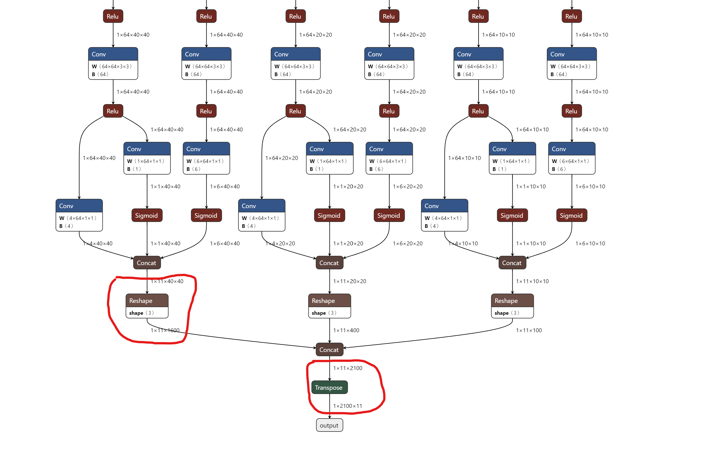
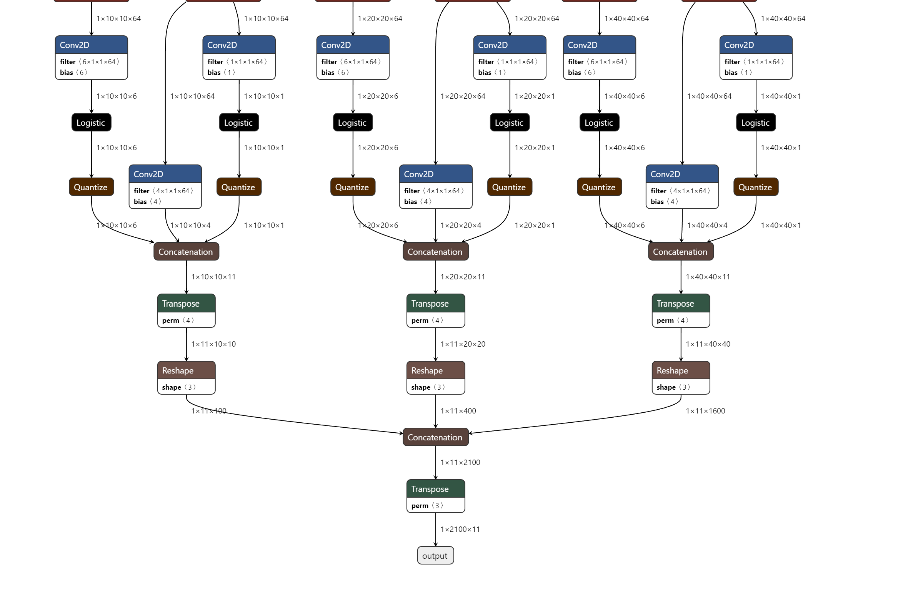
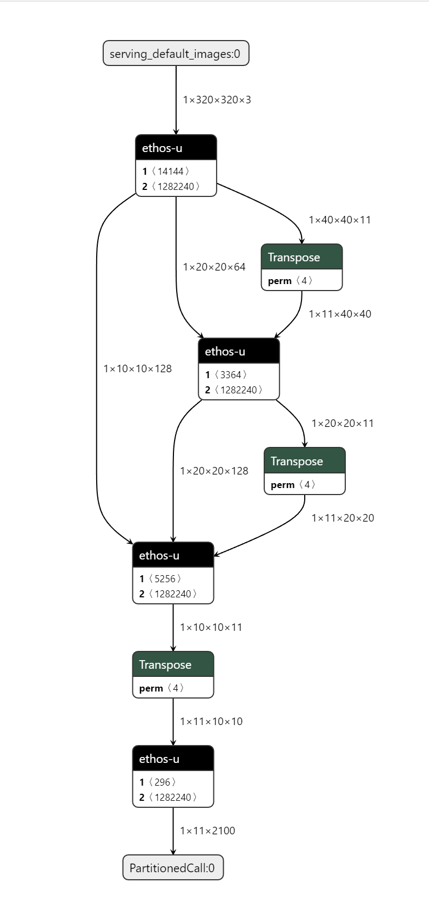
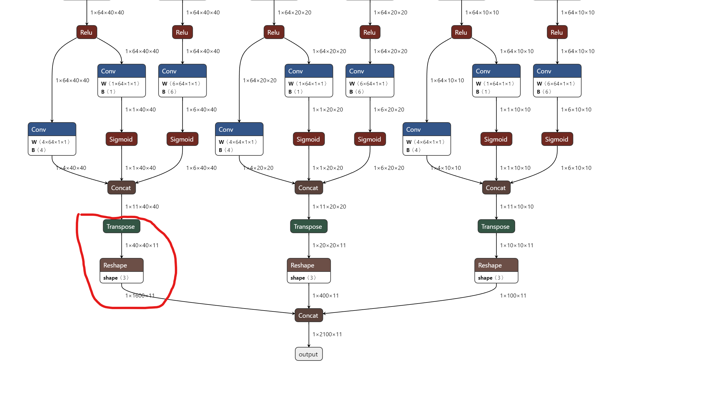
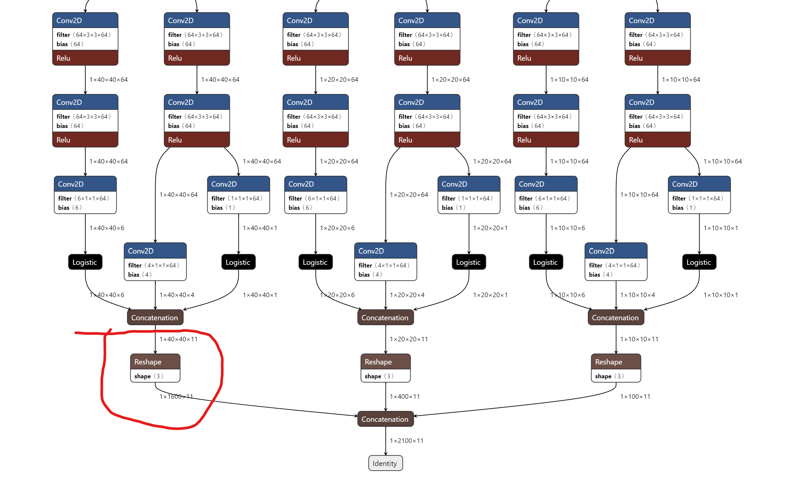
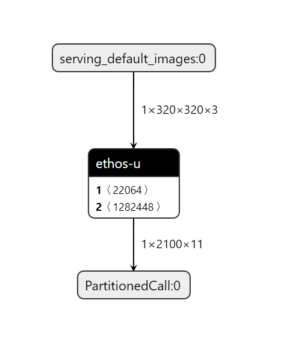

# Update yolo_head for ARM Vela Compiler
- Need NHWC reshape for tflite format, if not, at converting step, there will be transposes layers to change the input format.

#### Original
- pytorch => onnx 
- onnx => tflite 
- vela 

#### Updated
- pytorch => onnx 
- onnx => tflite 
- vela 